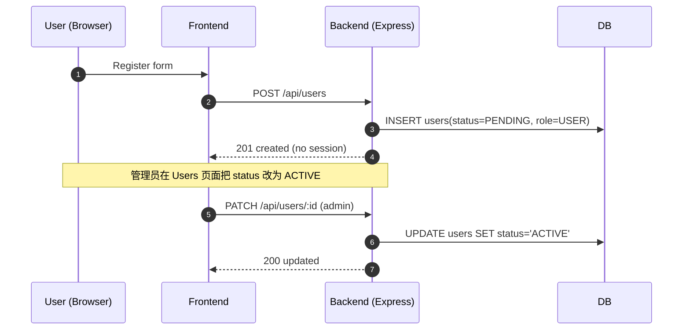
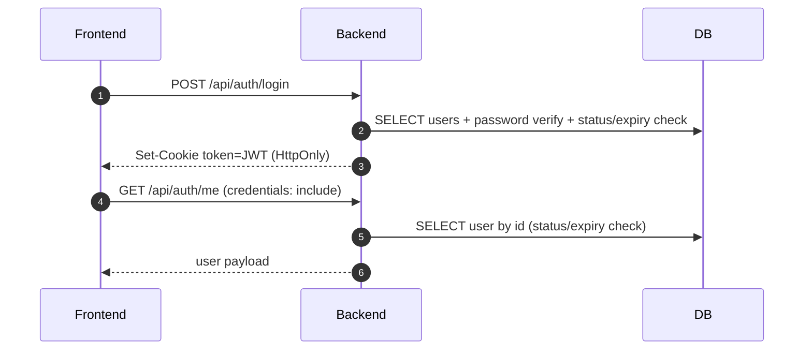
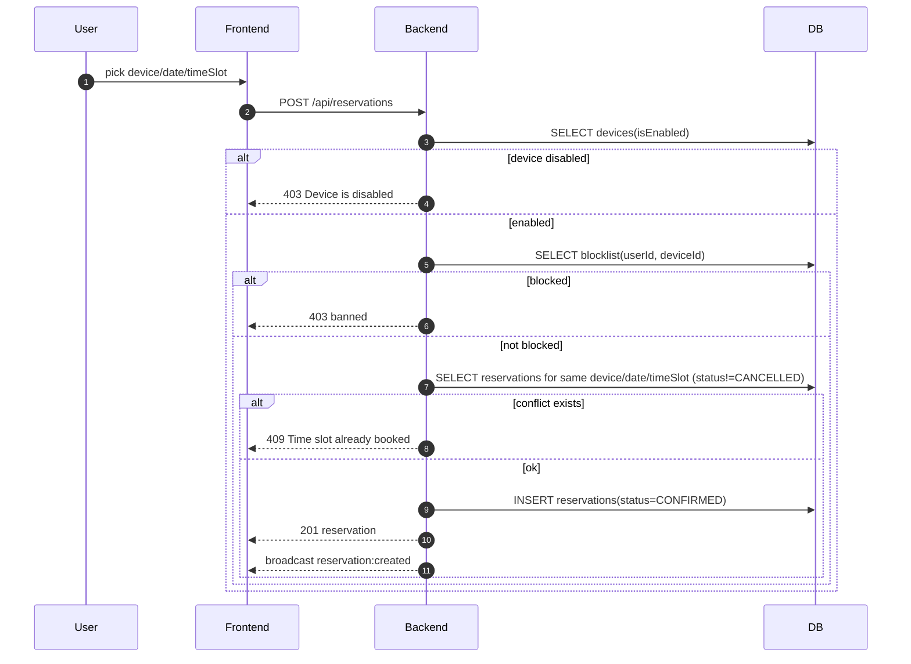
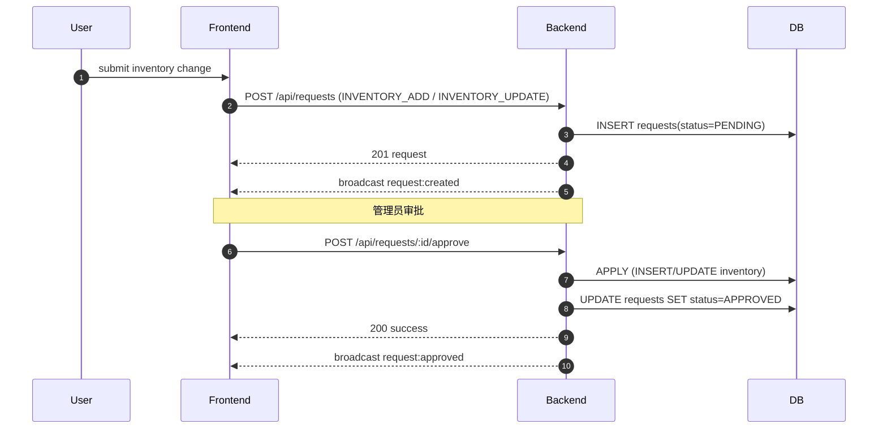
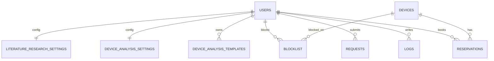

# Appointer（设备预约系统 / DRMS）

> Version 0.5.0 | 设备预约与协作管理系统

Appointer 是一个面向团队/实验室的设备预约与协作管理系统：支持设备开放规则配置、周视图日历预约、用户与权限管理、库存入库单（支持"申请-审批"）、操作日志与数据保留策略，并通过 Socket.IO 实现多端实时同步。

## 功能概览

### 预约与设备
- 设备管理：创建/编辑/删除、启用/停用、开放日期（周几）与开放时间配置
- 预约系统：周视图日历、冲突检测、取消/删除、标题/描述/颜色标注
- 黑名单（Blocklist）：管理员可限制某用户对某设备的预约权限

### 协作与治理
- 用户体系：注册/登录、账号审核（PENDING → ACTIVE）、到期时间、角色权限（USER / ADMIN / SUPER_ADMIN）
- 入库单（Inventory）：管理员可直接维护；普通用户提交变更/新增申请，管理员审核通过/拒绝
- 消息中心：展示已处理（APPROVED/REJECTED）的申请记录
- 操作日志：支持搜索与管理员清空
- 数据保留策略：SUPER_ADMIN 可配置日志/已处理申请保留天数，并可手动执行清理

### 统计与工具
- 排行榜：按预约总时长（timeSlot）统计用户排名（ADMIN/SUPER_ADMIN）
- Device Analysis：CSV 导入 → 选择真实 X 范围（可用 points 分组）→ 勾选 Y 列 → 图表/表格预览 → 导出（JSON）

## 技术栈

- 前端：React 19、React Router、Tailwind CSS、Vite、socket.io-client、date-fns、recharts、papaparse
- 后端：Node.js（ES Modules）、Express、Socket.IO
- 数据库：MySQL（默认，推荐生产）/SQLite（可选：sql.js 内存加载 + 导出持久化到 `server/drms.db`）
- 认证：JWT（HttpOnly Cookie `token`；前端 `fetch` 默认 `credentials: include`；后端也支持 `Authorization: Bearer <token>` 便于脚本/调试）

## 文档

- [`docs/README.md`](docs/README.md)：Specs/Runbooks 索引与阅读顺序
- [`docs/origin_open_in_origin_runbook.md`](docs/origin_open_in_origin_runbook.md)：Origin “Open in Origin” 联调/排障手册

## 项目架构（Architecture）

本项目采用「前端单页应用（React）+ 后端 API（Express）+ 数据库（MySQL/SQLite）」的典型结构，并通过 Socket.IO 在多端之间做实时同步；其中 Device Analysis 功能使用 Web Worker 在浏览器侧完成 CSV 解析与曲线抽取，避免阻塞 UI。

### 1）系统总览

```mermaid
flowchart LR
  subgraph FE[Frontend · React (Vite)]
    UI[Pages / Components]
    API[apiService (HTTP /api)]
    WS[socketService (WebSocket /socket.io)]
    W[deviceAnalysis.worker.js<br/>CSV preview & processing]
    UI --> API
    UI --> WS
    UI --> W
  end

  subgraph BE[Backend · Express + Socket.IO]
    REST[REST APIs]
    AUTH[Auth middleware<br/>(JWT + Cookie)]
    RT[Socket.IO events<br/>(broadcast)]
    DBL[DB Adapter<br/>(mysql2 / sql.js)]
    REST --> AUTH
    REST --> DBL
    RT --> DBL
  end

  DB[(MySQL / SQLite)]

  API -->|HTTP| REST
  WS <--> |WebSocket| RT
  DBL --> DB
```

开发模式下，前端由 Vite 提供（默认 `5173`），通过 `vite.config.js` 将 `/api` 与 `/socket.io` 代理到后端（默认 `3001`）。生产模式下可先构建 `dist/`，再由后端同源托管（见「部署提示」）。

### 2）目录结构与职责

```text
/
├─ src/                      # 前端源码（React）
│  ├─ pages/                 # 路由页面（业务入口）
│  ├─ components/            # 可复用组件（含 DeviceAnalysis 子模块）
│  ├─ routes/                # 路由与鉴权包装（PrivateRoute/AdminRoute）
│  ├─ context/               # 全局状态（Auth/Theme/Language）
│  ├─ services/              # 与后端/WS 交互（apiService/socketService）
│  ├─ workers/               # Web Worker（Device Analysis CSV 处理）
│  ├─ styles/ utils/ hooks/  # 样式/工具/自定义 hooks
│  └─ main.jsx / App.jsx     # 前端入口
├─ server/                   # 后端（Express + Socket.IO）
│  ├─ server.js              # 服务入口（路由 + socket + 静态托管）
│  ├─ src/config/            # 环境变量加载、DB 连接封装
│  ├─ src/db/                # SQLite(schema/migrate/seed) 与适配层
│  ├─ src/middleware/        # 鉴权、限流等中间件
│  ├─ scripts/               # init-db、迁移、验证脚本
│  └─ *.md / docker-compose  # 部署/迁移文档
├─ public/                   # 前端静态资源
└─ dist/                     # 前端构建产物（npm run build）
```

### 3）前端模块关系（React）

- 入口链路：`src/main.jsx` → `src/App.jsx`（Provider 组合）→ `src/routes/AppRoutes.jsx`（路由表）
- 全局状态：
  - `src/context/AuthContext`：登录态/用户信息（配合后端 HttpOnly Cookie）
  - `src/context/ThemeContext`、`src/context/LanguageContext`
- 与后端通信：
  - `src/services/apiService.js`：REST 调用（`/api/*`，默认携带 cookie）
  - `src/services/socketService.js`：WebSocket 连接与事件订阅（`/socket.io`）
- 典型业务页面：`src/pages/Devices.jsx`、`src/pages/DeviceBooking.jsx`、`src/pages/Users.jsx`、`src/pages/Inventory.jsx` 等

### 4）Device Analysis 子系统（浏览器侧 Worker）

Device Analysis 的核心是：把「CSV 解析/采样/分组/图例生成」这类 CPU 密集任务放到 Web Worker。

- UI/编排：`src/pages/DeviceAnalysis.jsx`
  - 预览 worker：读取 CSV 生成 preview 表格（选择范围/列时用）
  - 处理 worker：按模板配置逐文件抽取曲线 → 产出 `processedData`
- Worker 实现：`src/workers/deviceAnalysis.worker.js`
  - 解析 CSV，生成 X/Y 数据、分组（points/group）、legend labels
  - 输出 `xLabel`（来自 Var1）、series `name`（可拼接 Var2 前缀）
- 展示组件：`src/components/DeviceAnalysis/AnalysisCharts.jsx`、`src/components/DeviceAnalysis/DataPreviewTable.jsx` 等

### 5）后端模块关系（Express）

- 入口：`server/server.js`
  - REST API：`/api/*`（大部分接口在该文件内直接定义）
  - Socket.IO：连接管理 + 广播事件（用于多端实时同步）
  - 鉴权：`server/src/middleware/authMiddleware.js`
  - 运行期任务：`server/src/retention.js`（保留策略/定时清理）
- 数据访问：
  - MySQL：`server/src/db/mysql-adapter.js`（`mysql2`）
  - SQLite：`server/src/db/database.js`（`sql.js`，运行期 schema/migrate/seed）
  - 统一入口：`server/src/config/db.js`

### 6）认证与权限（AuthN/AuthZ）

#### 登录态（JWT + HttpOnly Cookie）

- 登录：`POST /api/auth/login`（带 `loginLimiter` 限流）→ 后端签发 JWT（24h）→ 写入 HttpOnly Cookie：`token`
- 会话检查：前端启动时 `GET /api/auth/me` 校验 cookie，并把用户信息写入 `AuthContext`
- 鉴权中间件：`authenticateToken`
  - 支持从 Cookie `token` 或 `Authorization: Bearer <token>` 读取
  - 通过后还会做一次 DB 反查并校验：`status === ACTIVE`、`expiryDate` 未过期

#### 角色与权限

- 角色：`USER` / `ADMIN` / `SUPER_ADMIN`
- 权限门禁：
  - `requireAdmin`：`ADMIN` 或 `SUPER_ADMIN`
  - `requireSuperAdmin`：仅 `SUPER_ADMIN`
- 用户生命周期：注册默认 `PENDING`，需要管理员把状态改为 `ACTIVE` 才能登录/使用

#### WebSocket 鉴权

- Socket.IO 握手阶段必须携带有效 token（Cookie/Bearer/`socket.handshake.auth.token` 任一）
- 通过后才会接收服务器的广播事件（用于多端实时同步）

### 7）实时同步（Socket.IO + React Query）

#### 服务端：广播模型

后端在数据变更处调用 `broadcast(event, payload)`，把变化广播给所有已鉴权连接：

- device：`device:created` / `device:updated` / `device:deleted`
- reservation：`reservation:created` / `reservation:updated` / `reservation:deleted`
- user：`user:created` / `user:updated` / `user:deleted`
- request：`request:created` / `request:approved` / `request:rejected` / `request:deleted`

#### 前端：订阅与缓存更新策略

- 连接与订阅：`src/hooks/useRealtimeSync.js`（登录后自动 `socketService.connect()` 并按需订阅事件）
- 缓存策略（React Query）：
  - 设备列表：`src/hooks/useDevicesRealtimeSync.js` 直接 `setQueryData()` 增量更新
  - 预约列表：`src/hooks/useReservationsRealtimeSync.js` 针对 `reservations/range` query 做“按范围增量维护”
  - 请求/消息等：部分页面直接在事件到来时触发 `load*()` 重新拉取（如 `Inventory.jsx`/`Messages.jsx`）

### 8）核心业务流程（从 UI 到 DB）

#### 8.1 注册与账号审核



#### 8.2 登录与会话恢复



#### 8.3 预约创建/冲突检测/禁用与拉黑



一致性保障：
- 逻辑层：创建预约前显式查冲突
- DB 层：SQLite 模式下会创建唯一索引（`reservations_unique_active`）防止并发双写

#### 8.4 库存“申请-审批”工作流

普通用户对库存的新增/修改不会直接写 `inventory`，而是写入 `requests`，由管理员审批后落库：



#### 8.5 数据保留策略（Retention）

- 设置存储：`system_settings`（key/value）
- 清理对象：
  - `logs`：按 `timestamp` 删除过期记录
  - `requests`：仅删除 `APPROVED/REJECTED` 且过期的记录
- 触发方式：
  - 启动时：`startRetentionScheduler(db)` 会检查是否到期并尝试执行
  - 手动：`POST /api/admin/retention/run`（仅 `SUPER_ADMIN`）

### 9）数据模型（ER & 关键约束）

> 详细字段列表见下方「数据模型（MySQL/SQLite）」章节；这里给出关系与约束的总览。



关键一致性/约束点：
- 预约防重复：同一 `deviceId + date + timeSlot`（且 `status != CANCELLED`）不能重复
- 拉黑防重复：同一 `userId + deviceId` 不能重复
- 请求保留：只对 `APPROVED/REJECTED` 的历史请求执行自动清理，避免影响待办

### 10）运行模式与配置（Dev / Prod / Mock）

#### 开发模式（推荐）

- 前端：`npm run dev`（Vite，默认 `http://localhost:5173`）
- 后端：`npm run server`（默认 `http://localhost:3001`）
- 代理：`vite.config.js` 将 `/api` 与 `/socket.io` 代理到 `3001`（同源体验，Cookie 可用）

#### 生产/同源模式（前后端一体）

- 构建前端：`npm run build` 生成 `dist/`
- 启动后端并托管 `dist/`：`cd server && SERVE_CLIENT=1 npm run start`

#### Mock 模式（前端脱离后端）

- 设置 `VITE_MOCK_API=true`
  - 前端 Auth 与 ApiService 会走本地 Mock（localStorage），并禁用 WebSocket 同步
  - 适合 UI 走查与无后端环境的演示

#### 常用环境变量

前端（Vite）：
- `VITE_API_BASE_URL`：API Base（默认 `/api`）
- `VITE_WS_URL`：WebSocket URL（默认同源）
- `VITE_ORIGINBRIDGE_API_BASE_URL`：提供给 OriginBridge 的绝对 API Base（开发环境常用 `http://127.0.0.1:3001/api`；生产同源可留空）
- `VITE_MOCK_API`：是否启用 Mock（`true/false`）

后端（Express）：
- `PORT`：端口（默认 `3001`）
- `CORS_ORIGIN` / `CLIENT_ORIGIN`：允许的前端 Origin（逗号分隔）
- `JWT_SECRET`：JWT 密钥（生产必须修改）
- `DB_TYPE`：`mysql`（默认）或 `sqlite`
- `DB_HOST/DB_USER/DB_PASSWORD/DB_NAME`：MySQL 连接参数
- `DB_PATH`：SQLite 文件路径（默认 `drms.db`，相对 `server/`，即 `server/drms.db`）
- `DB_SEED_DATA`：是否播种示例数据（生产建议 `0`）
- `SERVE_CLIENT`：是否托管 `dist/`（默认 `0`；同源部署设为 `1`）

### 11）功能模块索引（快速定位代码）

- 路由表：`src/routes/AppRoutes.jsx`
- 登录/注册：`src/pages/Login.jsx`、`src/pages/Register.jsx`；后端 `server/src/routes/authRoutes.js`
- 设备与开放规则：`src/pages/Devices.jsx`、`src/pages/CreateDevice.jsx`；后端 `server/server.js` 的 `/api/devices*`
- 预约周视图：`src/pages/DeviceBooking.jsx`、`src/pages/MyReservations.jsx`；后端 `/api/reservations*`
- 权限/用户管理：`src/pages/Users.jsx`；后端 `/api/users*`
- 库存与申请审批：`src/pages/Inventory.jsx`、`src/pages/Messages.jsx`；后端 `/api/inventory*`、`/api/requests*`
- 实时同步：`src/services/socketService.js`、`src/hooks/useRealtimeSync.js`、`server/server.js` 的 `broadcast()`
- Device Analysis：`src/pages/DeviceAnalysis.jsx`、`src/workers/deviceAnalysis.worker.js`、`src/components/DeviceAnalysis/*`
  - Var1 → `xLabel`（横坐标标题），Var2 → series legend 前缀（如 `Vg=0.5`）
- Literature Research：`src/pages/LiteratureResearch.jsx`；后端 `server/src/literatureService.js` + `/api/literature/*`

## 运行环境

- Node.js >= 18（建议 20+）
- npm >= 9

## 快速开始（本地开发）

### 1）安装依赖

```bash
npm install
cd server
npm install
cd ..
```

### 2）配置后端数据库（首次必做）

后端默认 `DB_TYPE=mysql`；首次运行前请先配置数据库类型与连接信息（否则后端可能会因 MySQL 未启动而启动失败）。

1) 复制 [`server/.env.example`](server/.env.example) 为 `server/.env`

2) 选择其一：
- SQLite（推荐本地开发，零依赖）：把 `DB_TYPE` 改成 `sqlite`（可保留 `DB_PATH=drms.db`）
  - 重置：删除 `server/drms.db`（下次启动会自动建表；`DB_SEED_DATA=1` 时会插入默认账号/示例数据）
- MySQL（推荐生产）：保持 `DB_TYPE=mysql` 并配置 `DB_HOST/DB_USER/DB_PASSWORD/DB_NAME`
  - Docker 快速 MySQL：见 [`server/DOCKER_MYSQL.md`](server/DOCKER_MYSQL.md)

可选：一键初始化（等价于“安装后端依赖 + 执行一次 db.init”）：`npm run server:init`

### 3）启动后端

```bash
npm run server
```

默认：`http://localhost:3001`

### 4）启动前端

```bash
npm run dev
```

默认：`http://localhost:5173`

## 开发命令

前端（根目录）：

```bash
npm run dev
npm run build
npm run preview
npm run lint
```

后端：

```bash
npm run server         # 等价于：cd server && npm run dev（watch 模式）
npm run server:init    # 安装后端依赖 + 初始化数据库（不清空已有数据；SQLite 重置需删 db 文件）
cd server && npm run start
cd server && npm run init-db
```

## 默认账号

| 用户名 | 密码 | 角色 |
| --- | --- | --- |
| admin | 123 | SUPER_ADMIN |
| manager | 123 | ADMIN |
| user | 123 | USER |

说明：
- 初始账号密码为明文（用于开发/演示）；新注册用户密码会使用 bcrypt 哈希（登录同时兼容旧明文密码）。
- 可运行 `node server/scripts/migrate-passwords.js` 将旧密码批量迁移为 bcrypt 哈希，并用 `node server/scripts/verify-security.js` 校验。

## 环境变量

### 前端（`.env`）

复制 `.env.example` 为 `.env`：

- `VITE_API_BASE_URL`（默认 `/api`；开发/预览模式由 Vite 代理到后端 `3001`）
- `VITE_WS_URL`（默认空，表示同源 `/socket.io`；开发/预览模式同样由 Vite 代理到 `3001`）
- `VITE_ORIGINBRIDGE_API_BASE_URL`（OriginBridge 需要的绝对 API Base；开发环境如 `http://127.0.0.1:3001/api`；生产同源可留空）
- `VITE_MOCK_API`（默认 `false`；设为 `true` 启用前端 Mock）

### 后端（`server/.env`）

复制 `server/.env.example` 为 `server/.env`：

- `PORT`（默认 `3001`）
- `CORS_ORIGIN`（默认包含 `localhost/127.0.0.1` 的 dev/preview 端口；支持逗号分隔多个 origin）
- `DB_TYPE`（`mysql` 默认 / `sqlite`）
- MySQL：`DB_HOST` / `DB_PORT` / `DB_USER` / `DB_PASSWORD` / `DB_NAME` / `DB_CONNECTION_LIMIT` / `DB_CREATE_DATABASE`
- SQLite：`DB_PATH`（默认 `drms.db`，相对 `server/`）
- `JWT_SECRET`（建议生产环境务必覆盖；默认值仅用于开发）
- `NODE_ENV=production` 时 Cookie 将启用 `secure: true`（需要 HTTPS）

## 项目结构

```text
.
├─ public/                   # 静态资源
├─ src/                      # 前端源码
│  ├─ assets/                # 图片/图标等
│  ├─ components/            # 业务组件（WeeklyCalendar/BookingPopover/...）
│  │  ├─ ui/                 # 通用 UI 组件（Button/Card/Toast/...）
│  │  └─ DeviceAnalysis/     # CSV 分析工具组件
│  ├─ context/               # Auth/Theme/Language Context + Provider
│  ├─ hooks/                 # useAuth/useTheme/useLanguage/...（以及其它 hooks）
│  ├─ routes/                # 路由表 + Route Guard（Private/Admin）
│  ├─ layouts/               # MainLayout/AuthLayout
│  ├─ pages/                 # 页面路由（Dashboard/Devices/Inventory/...）
│  ├─ services/              # apiService / socketService
│  ├─ styles/                # 全局样式
│  └─ utils/                 # 工具方法
└─ server/                   # 后端源码
   ├─ server.js              # Express + Socket.IO + REST API
   ├─ scripts/               # 调试/维护脚本
   │  ├─ init-db.js          # 初始化数据库（按 DB_TYPE）
   │  ├─ test-api.js         # 手动测试 API
   │  ├─ migrate-passwords.js   # 明文密码迁移为 bcrypt
   │  └─ verify-*.js         # 校验脚本（realtime/inventory/security）
   └─ src/                   # 认证/中间件（JWT Cookie）
      ├─ config/             # env/db 统一出口（env.js/db.js）
       ├─ db/                 # 数据库抽象层（MySQL/SQLite）+ schema
       ├─ retention.js        # 日志/已处理申请保留策略
       ├─ controllers/        # authController.js
       ├─ middleware/         # authMiddleware.js / rateLimiter.js
       └─ routes/             # authRoutes.js
```

## 前端页面路由

- `/dashboard`：仪表盘（日志、待审核用户、待处理申请）
- `/devices`：设备列表（管理员可管理设备开关/配置）
- `/devices/:id`：预约日历（周视图 + 实时同步）
- `/reservations`：我的预约（管理员可切换查看其他用户）
- `/inventory`：入库单（普通用户走申请流；管理员直接改）
- `/messages`：消息中心（已处理申请）
- `/users`：用户管理（ADMIN/SUPER_ADMIN）
- `/leaderboard`：排行榜（ADMIN/SUPER_ADMIN）
- `/device-analysis`：CSV 分析工具
- `/settings`：设置（主题/语言；SUPER_ADMIN 可配置数据保留策略）

## Device Analysis（CSV）使用说明

Template 会以**第一个导入的 CSV**作为预览基准，但会对**所有已导入 CSV**应用同一套提取规则。

相关计算/实现说明：
- gm（`dI/dX` / `dI/dLegend @ fixed X`）：[`docs/gm_spec_v1.md`](docs/gm_spec_v1.md)
- On/Off（`|I|on` / `|I|off` / `Ion/Ioff`）：[`docs/onoff_spec_v1.md`](docs/onoff_spec_v1.md)
- SS Fit（Subthreshold Swing）：[`docs/ssfit_spec_v1.md`](docs/ssfit_spec_v1.md)
- Origin 一键出图集成方案：[`docs/origin_integration_spec_v1.md`](docs/origin_integration_spec_v1.md)
- Origin “Open in Origin” 调试手册：[`docs/origin_open_in_origin_runbook.md`](docs/origin_open_in_origin_runbook.md)

### 1）设置真实 X（必填）

- 在「X Data」里填写或选择 `Start Cell` / `End Cell`（例如 `A2` 到 `A1408`）。
- 可在输入框获得焦点后，直接在右侧预览表格点击单元格自动填充（`A1` 风格引用）。
- 约束：`Start/End` 必须在**同一列**（同一个真实 X 列）。

### 2）points 分组（可选）

`Points` 表示“每条曲线包含的点数”（按 X 范围顺序切分）：

- 留空：整个 X 范围就是 1 组（1 条曲线）。
- 填整数：将 X 范围按 `Points` 切成多组，每组对应同一张图中的一条曲线。
  - 示例：`A2-A1408` 共 `1407` 点，`Points=201` ⇒ `1407/201=7` 组 ⇒ 同一张图里 `7` 条 line（每个 Y 列都会生成 7 条）。
- 强校验：若 `X 点数 % Points !== 0`，会 toast 警告并**停止提取**（不生成结果）。

### 3）选择 Y 列（必填）

- 在预览表格的列标题（A/B/C…）点击勾选需要的 Y 列。
- 约束：Y 列不能包含 X 列。

### 4）应用与导出

- 点击 `Apply to All Files`：对所有已导入 CSV 执行提取；默认单个文件遇到空值/非数字会记录错误并跳过（不中断其它文件）；可勾选 `Stop on first invalid file` 改为遇错即停。
- `Charts`：使用真实 X 绘制多条线（支持同一张图多条 line）。
- `Data Table`：按文件 + series 查看点数据。
- `Export Data`：导出 `device_analysis_export.json`。

## API 概览（后端：`/api`）

标记说明：
- `[auth]`：需要登录（`token` Cookie 或 `Authorization: Bearer <token>`）
- `[admin]`：需要 ADMIN/SUPER_ADMIN
- `[super_admin]`：需要 SUPER_ADMIN

### 认证

- `POST /api/auth/login`：登录（设置 `token` Cookie；有登录限流）
- `POST /api/auth/logout`：退出（清除 Cookie）
- `GET /api/auth/me` [auth]：获取当前用户

### 用户

- `GET /api/users` [auth] [admin]：获取用户列表
- `POST /api/users`：用户注册（默认 `role=USER`，`status=PENDING`，密码 bcrypt 哈希）
- `POST /api/admin/users` [auth] [admin]：管理员创建用户（ADMIN 只能创建 USER；SUPER_ADMIN 可创建 ADMIN/USER）
- `PATCH /api/users/:id` [auth]：更新用户
  - 本人：可更新 `name/email/username`
  - ADMIN：仅可更新 USER 的 `status/expiryDate`（以及 `name/email/username`）
  - SUPER_ADMIN：可额外更新 `role`
- `DELETE /api/users/:id` [auth] [admin]：删除用户（不可删自己；ADMIN 只能删除 USER）

### 黑名单（Blocklist）

- `GET /api/users/:id/blocklist` [auth]：查看用户黑名单（管理员或本人）
- `POST /api/users/:id/blocklist` [auth] [admin]：拉黑用户对某设备的预约（管理员）
- `DELETE /api/users/:id/blocklist/:deviceId` [auth] [admin]：解除拉黑（管理员）

### 设备

- `GET /api/devices`：设备列表
- `GET /api/devices/:id`：设备详情
- `POST /api/devices` [auth] [admin]：创建设备
- `PATCH /api/devices/:id` [auth] [admin]：更新设备（启用/停用、开放规则等）
- `DELETE /api/devices/:id` [auth] [admin]：删除设备

### 预约

- `GET /api/reservations` [auth]：预约列表（当前实现返回全部预约，用于日历占用展示）
- `POST /api/reservations` [auth]：创建预约（含冲突检测 + 黑名单检查）
- `PATCH /api/reservations/:id` [auth]：更新预约（本人或管理员）
- `DELETE /api/reservations/:id` [auth]：删除预约（本人或管理员）

### 入库单（Inventory）

- `GET /api/inventory?search=` [auth]：查询入库单（支持模糊搜索）
- `POST /api/inventory` [auth] [admin]：新增入库单
- `PATCH /api/inventory/:id` [auth] [admin]：更新入库单
- `DELETE /api/inventory/:id` [auth] [admin]：删除入库单

### 申请（Requests）

- `GET /api/requests?status=&limit=&offset=` [auth]：查询申请（普通用户仅可见自己的；管理员可见全部）
- `POST /api/requests` [auth]：提交申请（如 `INVENTORY_ADD` / `INVENTORY_UPDATE`）
- `POST /api/requests/:id/approve` [auth] [admin]：审核通过（管理员）
- `POST /api/requests/:id/reject` [auth] [admin]：审核拒绝（管理员）
- `DELETE /api/requests/:id` [auth]：删除/撤回申请（管理员可删任意；普通用户仅可撤回 PENDING）

### 日志 & 保留策略

- `GET /api/logs?search=&limit=` [auth]：查询日志（普通用户仅可见自己的）
- `DELETE /api/logs` [auth] [admin]：清空日志（管理员）
- `GET /api/admin/retention` [auth] [super_admin]：查询保留策略（SUPER_ADMIN）
- `PATCH /api/admin/retention` [auth] [super_admin]：更新保留策略（SUPER_ADMIN）
- `POST /api/admin/retention/run` [auth] [super_admin]：立即执行清理（SUPER_ADMIN）

### 统计

- `GET /api/admin/leaderboard` [auth] [admin]：排行榜（ADMIN/SUPER_ADMIN）

## WebSocket 事件（服务端广播 → 客户端）

- 设备：`device:created` / `device:updated` / `device:deleted`
- 预约：`reservation:created` / `reservation:updated` / `reservation:deleted`
- 用户：`user:created` / `user:updated` / `user:deleted`
- 申请：`request:created` / `request:approved` / `request:rejected` / `request:deleted`

## 数据模型（MySQL/SQLite）

运行时 schema 由 `server/src/db/database.js` 维护（自动建表 + 迁移 + 索引）。

- `users`：`id` `username` `password` `role` `status` `name` `email` `expiryDate`
- `devices`：`id` `name` `description` `isEnabled` `openDays(JSON)` `timeSlots(JSON)` `granularity` `openTime(JSON)`
- `reservations`：`id` `userId` `deviceId` `date(YYYY-MM-DD)` `timeSlot(HH:MM-HH:MM)` `status` `createdAt` `title` `description` `color`
- `inventory`：`id` `name` `category` `quantity` `date` `requesterName` `requesterId`
- `requests`：`id` `requesterId` `requesterName` `type` `targetId` `originalData(JSON)` `newData(JSON)` `status` `createdAt`
- `logs`：`id` `userId` `action` `details` `timestamp`
- `blocklist`：`id` `userId` `deviceId` `reason` `createdAt`
- `system_settings`：`key` `value` `updatedAt`

关键索引：
- 防止重复预约：`reservations(deviceId, date, timeSlot)`（仅对未取消状态生效）
- 防止重复拉黑：`blocklist(userId, deviceId)`

## 常用脚本

- 初始化/重置 DB：`npm run server:init`
- 迁移旧密码为 bcrypt：`node server/scripts/migrate-passwords.js`
- 校验密码哈希：`node server/scripts/verify-security.js`
- 查看用户数据：`node server/scripts/view-users.js`
- 校验实时广播（需先启动后端）：`node server/scripts/verify-realtime.js`
- 检查入库数据：`node server/scripts/verify-inventory.js`

## 部署提示（简版）

### 单机部署（同域名）

- 前端：`npm run build` 生成 `dist/`，用 Nginx/静态服务托管
- 后端：`cd server && npm run start`（或使用 PM2）
- Nginx 需反代 `/api` 与 `/socket.io`，并开启 WebSocket Upgrade

示例（仅示意）：

```nginx
location /api/ {
  proxy_pass http://127.0.0.1:3001;
}

location /socket.io/ {
  proxy_pass http://127.0.0.1:3001/socket.io/;
  proxy_http_version 1.1;
  proxy_set_header Upgrade $http_upgrade;
  proxy_set_header Connection "upgrade";
}
```

### 前后端分离部署（跨域 Cookie）

当前后端登录依赖 HttpOnly Cookie，若前端与后端跨“站点”部署（不同 site 域名），需要：
- 修改 `server/src/controllers/authController.js` 中 Cookie `sameSite: "lax"` 为 `sameSite: "none"`，并确保 `secure: true`（必须 HTTPS）
- 后端 CORS 允许对应 origin，并开启 `credentials: true`
- 前端请求保持 `credentials: include`（项目已默认开启）

## 常见问题

- 登录后接口仍 401：检查浏览器是否带上 `token` Cookie（跨站点部署需按上方“跨域 Cookie”处理）。
- CORS 报错：设置 `server/.env` 的 `CORS_ORIGIN`（可逗号分隔），并重启后端。
- 注册后无法登录：新用户默认 `status=PENDING`，需要管理员在 `/dashboard` 审核通过后才能登录。
- 多次登录失败被限制：`POST /api/auth/login` 有限流（15 分钟内最多 5 次），等待窗口期后再试。

## 安全与已知限制

- 生产环境务必设置强随机 `JWT_SECRET`，并配合 HTTPS 部署（`NODE_ENV=production` 时 Cookie 才会启用 `secure: true`）。
- 跨站点部署目前需要手动调整 Cookie 的 `sameSite`（见上方“跨域 Cookie”）。
- MySQL：后端已支持 MySQL，默认使用 MySQL；如需切回 SQLite，请设置 `DB_TYPE=sqlite`。
- 设置页“修改密码”目前仅前端交互，尚未对接后端接口。
